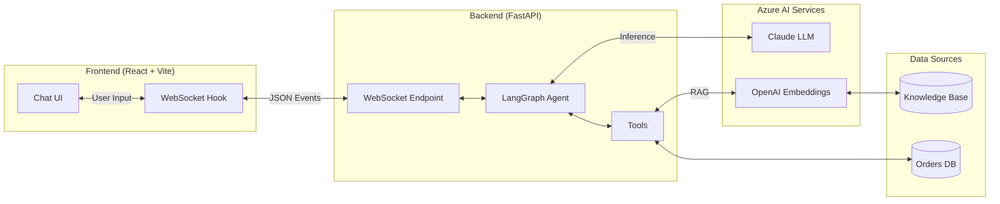

# Customer Support Chat Demo

A full-stack AI-powered customer support chatbot built with LangChain + LangGraph (backend) and React + Tailwind (frontend).

## Features

- **Real-time streaming** via WebSockets
- **Tool execution visibility** - see when the AI calls tools
- **Expandable tool outputs** - inspect tool results
- **Thinking indicators** - know when the AI is processing
- **Professional UI** - dark theme, smooth animations
- **Session-based memory** - conversation persists during session

## Architecture



## Prerequisites

- Python 3.10+
- Node.js 18+
- Azure AI Foundry access (Claude + OpenAI Embeddings)

## Setup

### Backend

```bash
cd backend

# Create virtual environment
python -m venv venv
venv\Scripts\activate  # Windows
# source venv/bin/activate  # Linux/Mac

# Install dependencies
pip install -r requirements.txt

# Configure environment
cp .env.example .env
# Edit .env with your Azure credentials
```

### Frontend

```bash
cd frontend

# Install dependencies
npm install
```

## Running

### Start Backend

```bash
cd backend
uvicorn main:app --reload --port 8000
```

### Start Frontend

```bash
cd frontend
npm run dev
```

Open http://localhost:5173 in your browser.

## Environment Variables

Create `backend/.env` with:

```env
# Azure Anthropic (Claude)
AZURE_ANTHROPIC_ENDPOINT=https://your-endpoint.azure.com
AZURE_ANTHROPIC_API_KEY=your-api-key
AZURE_ANTHROPIC_MODEL=claude-opus-4-6

# Azure OpenAI (Embeddings)
AZURE_OPENAI_ENDPOINT=https://your-openai.openai.azure.com
AZURE_OPENAI_API_KEY=your-api-key
AZURE_OPENAI_EMBEDDING_DEPLOYMENT=text-embedding-3-small
AZURE_OPENAI_API_VERSION=2024-02-01
```

## WebSocket Events

### Client → Server
```json
{"type": "message", "content": "user message"}
{"type": "clear"}
{"type": "ping"}
```

### Server → Client
```json
{"type": "thinking", "content": "Analyzing..."}
{"type": "tool_call", "name": "lookup_order", "args": {"order_id": "ORD-001"}}
{"type": "tool_result", "name": "lookup_order", "result": "..."}
{"type": "response", "content": "text chunk", "done": false}
{"type": "done", "messages": [...]}
{"type": "error", "content": "error message"}
```

## Available Tools

| Tool | Description |
|------|-------------|
| `lookup_order` | Look up order status and tracking |
| `search_knowledge_base` | Search policies and FAQs |
| `check_return_eligibility` | Check if order can be returned |
| `escalate_to_human` | Escalate to human support |

## Sample Queries

- "What's your return policy?"
- "Track my order ORD-001"
- "Can I return order ORD-003?"
- "What payment methods do you accept?"
- "I need to speak to a human"

## Project Structure

```
customer-support-demo/
├── backend/
│   ├── main.py           # FastAPI + WebSocket
│   ├── agent.py          # LangGraph agent
│   ├── requirements.txt
│   └── .env.example
├── frontend/
│   ├── src/
│   │   ├── components/   # React components
│   │   ├── hooks/        # WebSocket hook
│   │   ├── types/        # TypeScript types
│   │   └── App.tsx
│   ├── package.json
│   └── vite.config.ts
└── README.md
```

## License

MIT
